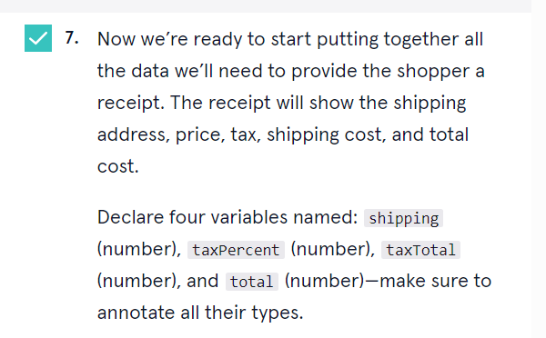

          


<a type="button" title="Codecademy_Learn_TypeScript_Course_button" href="https://www.codecademy.com/courses/learn-typescript/projects/typemart" target="_blank" data-CodecademyLearnTypescriptCourseButt="CodecademyLearnTypescriptCourseButt_data"></a>

<br><br>

# TypeMart
<br>

# 1. Introduction:

<br>
<br>

# 2. Output:

<br>
<br>

# 3. Prompts:


```js
if(Boolean(product.preOrder)===true){
  console.log("We'll send you a message when your product is on its way.");
}
```




```js
if(Number(product.price) >= 25){
  shipping=0;
  console.log("We provide free shipping for this product")
}else{
  shipping=5;
}
```


```js
if(shippingAddress.includes("New York")){
  taxPercent = 0.1;
}else{
  taxPercent = 0.05;
}
```

```js
taxTotal = Number(product.price) * taxPercent;
total = Number(product.price)+taxTotal+shipping;
```

```js

console.log(`Product name: ${product.name}.\nShipping address: ${shippingAddress}.\nPrice of the product: \$${product.price}.\nTax total: \$${taxTotal}.\nShipping: \$${shipping}.\nTotal amount: \$${total}.\n`);
```
